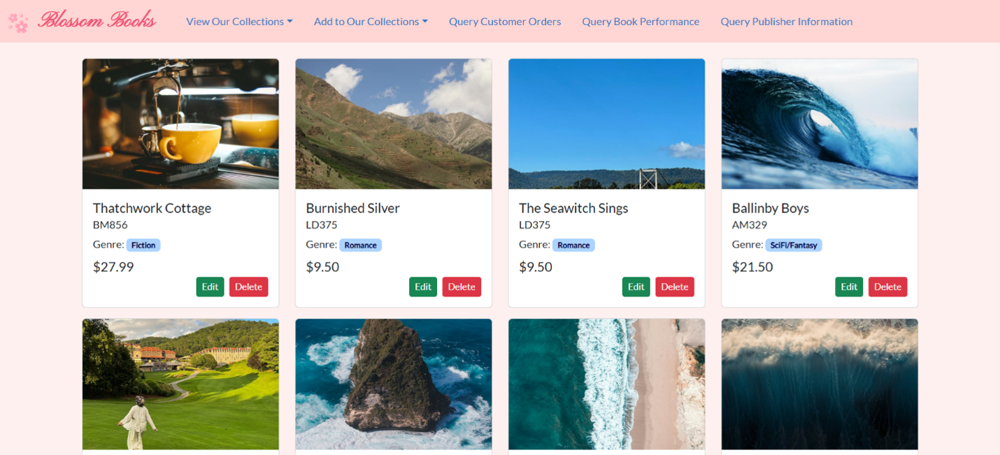
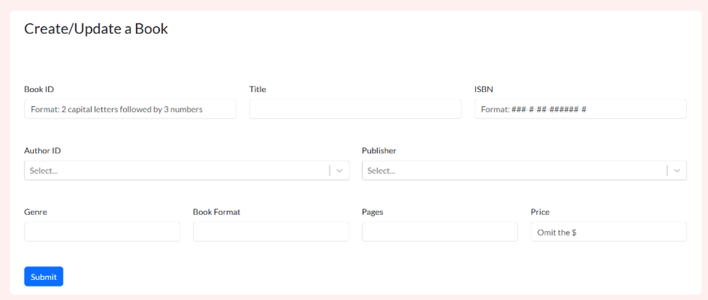
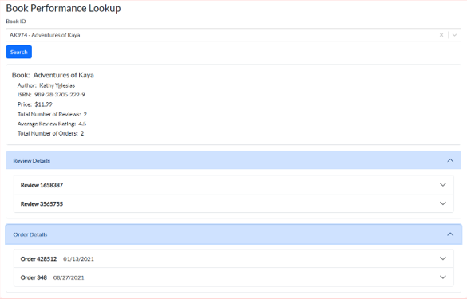
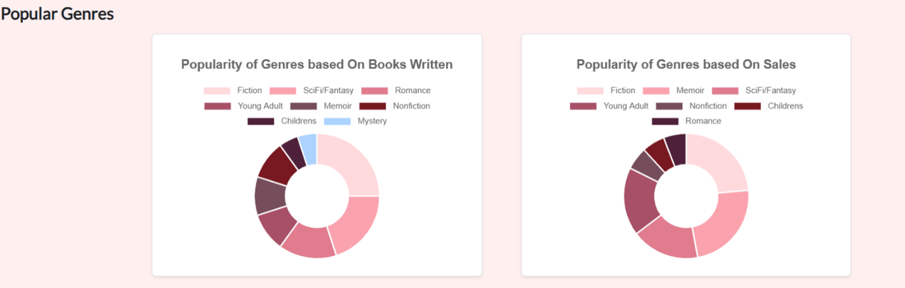

# Blossom Books
A full-stack bookstore management and analytics application built with React, Node.js, Express, and MongoDB.
Originally made as an academic project.

## Overview
Blossom Books provides users with an interface for managing books, authors, customers, publishers, reviews, and orders.
This application supports CRUD operations, data visualization, and multi-collection queries for analyzing bookstore data.

## Tech Stack
- React
- Node.js
- Express
- MongoDB
- React Bootstrap
- Chart.js

## Data Management
- Books
- Authors
- Customers
- Publishers
- Reviews
- Orders

### CRUD Operations
- Create, read, update, and delete records in each collection
- Validates related records
- Automatic calculates order totals
- Automatically generates placeholder cover images

### Analytics
- Visualizes genre popularity
- Analyzes author performance
- Queries customer order summaries
- Queries book performance
- Queries publisher information

## Screenshots

### Books Homepage

### Books Management

### Books Performance Analysis

### Visual Analysis

## Project Structure
- `client/` - React frontend
- `server/` - Node.js/Express backend

## Running Locally

### Prerequisites
- Node.js
- MongoDB

### Backend
1. Navigate to `server/`
2. Install dependencies with 'npm install'
3. Create a `.env` file using `.env.example`
4. Add your MongoDB connection string
5. Start the server with 'npm start'

### Frontend
1. Navigate to `client/`
2. Install dependencies with 'npm install'
3. Start the development server